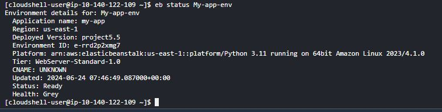

# **Project 5.5: modernizing the infrastructure for a small e-commerce startup**

# Project Goals:

1. Understand The project from the scenario given
2. Begin by researching and obtaining a simple static website template or sample website from the internet. 3.Ensure that the website includes HTML, CSS, and JavaScript files to simulate a typical web application
3. Deploy Web Server on AWS Lambda
4. Deploy Web Server on Elastic Beanstalk
5. Application to the infrastructure
6. Performance and Scalability Comparison
7. Monitor and compare the performance and scalability of the web server deployed on AWS Lambda and Elastic Beanstalk.
8. Analyze cost implications of deploying the web server on AWS Lambda versus Elastic Beanstalk.
9. Ensure you DELETE all your resources after you are done.

# Step-by-Step Implementation

1. Deploying on AWS Lambda

- Create an S3 Bucket and Upload Website Files
  

2. Create Lambda Function

- Navigate to the AWS Lambda console, create a new function using Node.js or Python.
- Use the AWS SDK to retrieve files from S3 and save them
  

3. Set Up API Gateway

- Create a new API in API Gateway.
- Set up a GET method that triggers the Lambda function:

1. Create a New API:

   - In the API Gateway console, create a new REST API Create a Resource and Method:
     

2. Create a new resource (e.g./).

   - Add a GET method to the resource.
   - Integrate with Lambda:
     

3. Set the integration type to Lambda Function.
   - Choose the Lambda function you created earlier.
4. Deploy the API:
   - Deploy the API to a stage and obtain the endpoint URL
     

# Deploying on Elastic Beanstalk

1. Initialize Elastic Beanstalk Application
2. Create and Deploy Environment
   

# Monitoring and Load Testing

## Use AWS CloudWatch:

1. Set up CloudWatch alarms for metrics like CPU utilization, memory usage, and request count.
   

2. Set up CloudWatch alarms for metrics like CPU utilization, memory usage, and request count.
   
